# Escape Room Game Terminal Application

For my term 1 assignment 3 at Coder Academy I have chosen to create a grid based escape room game.

The game is about escaping the room you have been placed in.  You will enter inputs to move through a hidden 4x4 grid, find clues, find the key and find the exit door to escape. Once you have escaped the room the game is over and you have won!

Have fun, and escape if you can!

## Links

[Github Repository](https://github.com/MikeLS95/Escape-Room---Terminal-App)

[PEP8 - Style Guide](https://peps.python.org/pep-0008/)

[Trello - Implementation Plan](https://trello.com/b/uB4Wjhkn/escape-room)


## Code Styling

For this project I have used the coding style guide of PEP 8.  I have done my best with following the style guide for everything including line length, spacing, etc.

Here is a link to the style guide:  [PEP8](https://peps.python.org/pep-0008/)

## List of Features

### Feature 1: Menu

On the launch of the terminal application, the person playing will be asked for their character name.  Once the character name has been provided, the menu screen will launch.

The menu starts with a banner that has been generated using the figlet module.  After the banner, there are two options, 1. Play 4x4 Grid & 2. Exit application.

If the player selects 2. they will receive a printed message saying "Thanks for playing!"

If the player selects option 1. the console will launch the game, with the player on the start position of the grid.

### Feature 2: Grid

The grid is where the game will be played.  After selecting option 1 from the menu, the grid is printed and the players name is shortened down to the first letter, making this letter a capital letter, if it was not already.

Under the grid that has now been printed with the characters avatar in the start position, instructions on how to play the game appear.  These instructions read "Where would you like to move? ('up', 'down', 'left', 'right' or 'menu' to return to main menu):".

Now that the player has their instructions, if they enter an input from the above instructions, the grid will be reprinted with an updated character position.  This is achieved by the Grid class.  The Grid class prints out the grid upon any player input.

The get_position function works by printing the grid, but updating the current position using the direction and movement variables.  Each movement input has assigned coordinates depending on the input, up = [y=-1, x=0], down = [y=1, x=0], left = [y=0, x=-1] and right = [y=0, x=1].  These inputs allow the player to move one square at a time throughout the gird.

If the player chooses to enter 'menu' they will be returned to the main menu, reprinting the banner and the input options.

The grid by default hides all objects from player view, the only way the player will know if they have landed on an object square, is if they read the printed messages.

### Feature 3: Clues

There are clues at predetermined coordinates in the grid, these coordinates are determined in the Clues class in features.py.  The clue class works, by having preassigned y and x positions.  Each clue space has five different printable clues available, these are unique for each time the game is run.

The clues are randomly generated depending on their position from the clues.json file.  The json file will load, the depending on the position it will print at random (random.choice) from the list of five available clues.

The clues are designed to give assistance to players who could find themselves lost in the grid. Some clues are more vague than others to help the player find either the key or the exit door, some clues will provide hints as to both.

### Feature 4: Key

The key is has a set position on the map, and is contained on the Player class and by default is set to False.

Once the player walks onto the square containing the key, they will receive a printed message telling them they have obtained the key.

Once the key has been obtained, the value of key is set to True.

The key is required to open the exit door, this is a requirement for winning the game.

### Feature 5: Exit Door

The exit door by default is locked.  This is achieved using the key variable.

If the player walks onto the exit door without the key, they will receive a message telling them that the door is locked and they will need to find a key to unlock it.

If the player has walked onto the key square and the key variable is set to True, they will be able to exit through the door.  Exiting through the door will print a message to the player saying 'Congratulations (Player name that has been received upon launching the game), you have escaped!'.

After the above message is displayed, a timer for 2seconds will start, this is hidden from the players view.  After the time has elapsed, another message will print saying 'Game over! Thanks for playing' and then the menu will print under the message giving the player the options to replay or to exit the application, from the menu.

## Implementation Plan

I have taken a screenshot at the start of every day that I worked on the terminal application.

I used trello to record my progress on the Escape Room game.

Below are screenshots of my daily progress and screenshots for the content of each of the features checklist.  These checklists were made to ensure I stayed on track and implemented all of the features and their contents required for making the escape room interactive and playable without any bugs.

### Full Board

Friday May 3rd

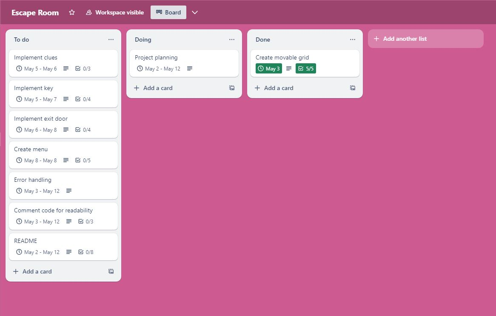

Sunday May 5th

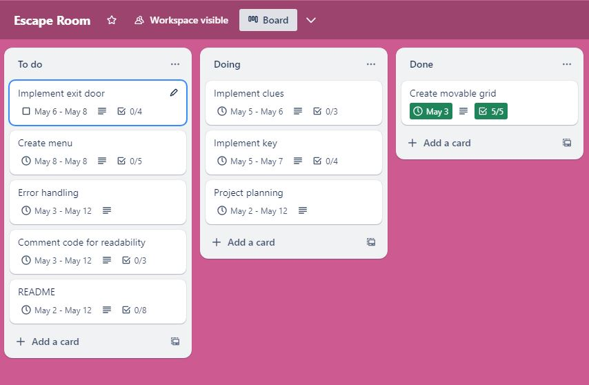

Monday May 6th

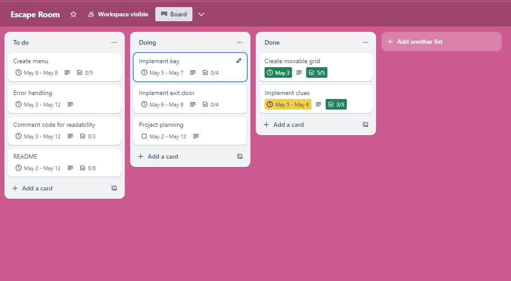

Tuesday May 7th

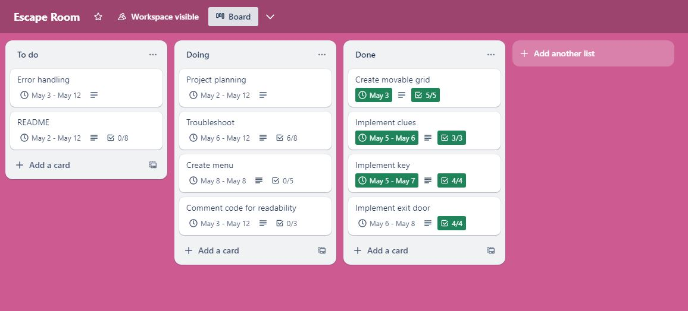

Wednesday May 8th

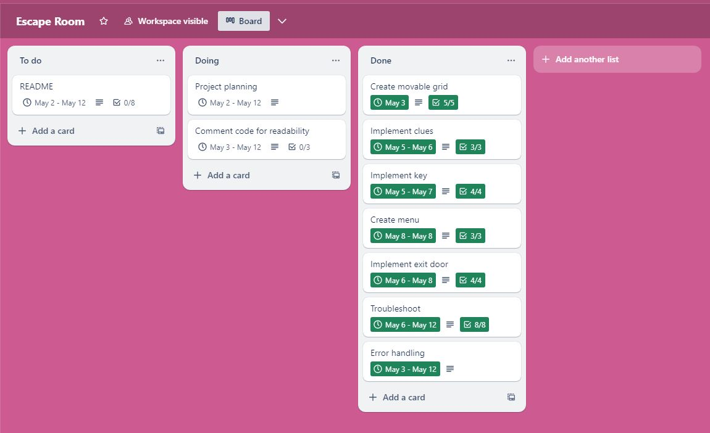

Friday May 10th

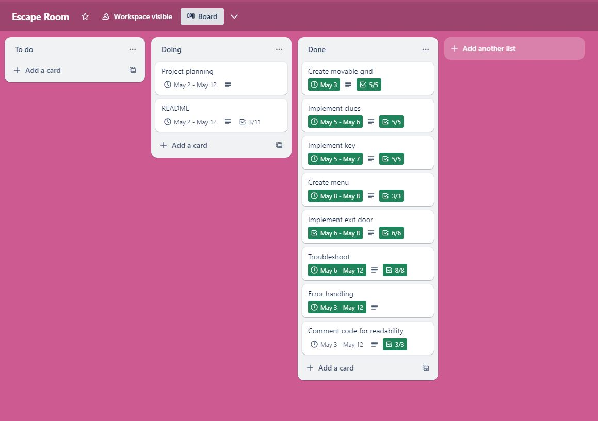

Completed Plan

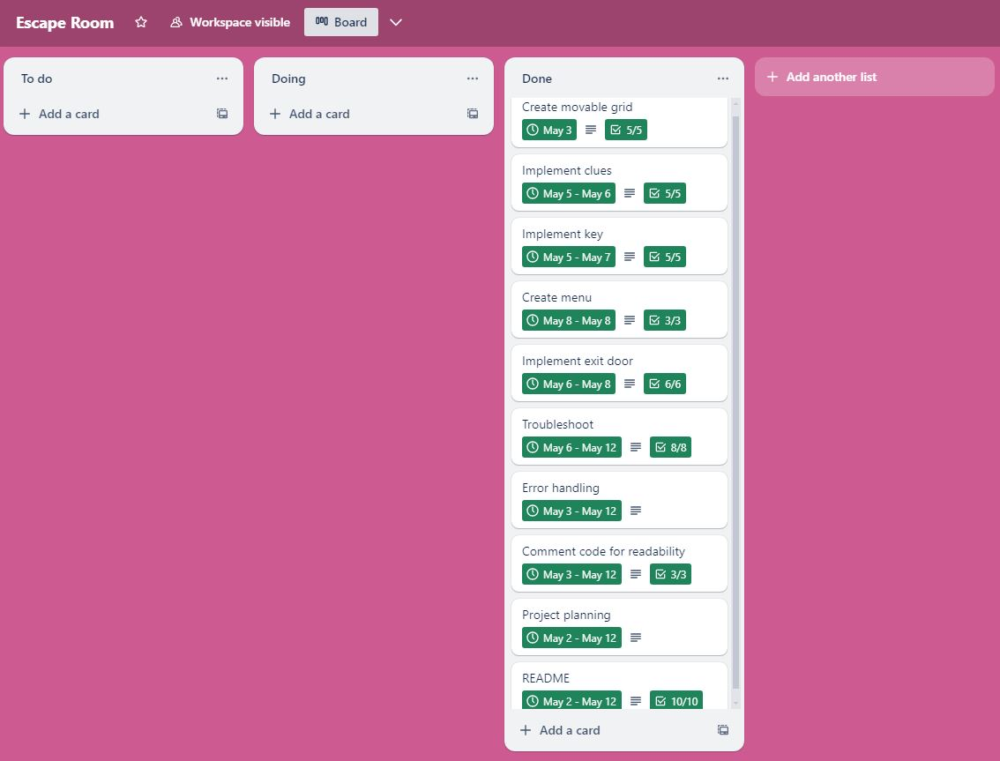

### Feature Checklist

1. Menu

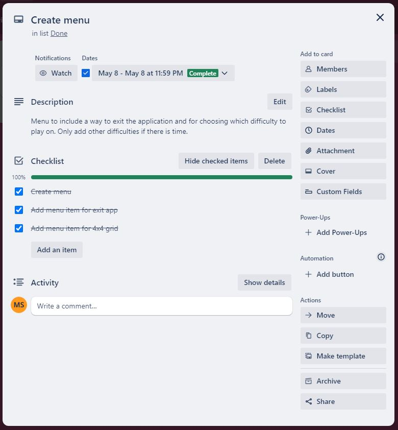

2. Grid

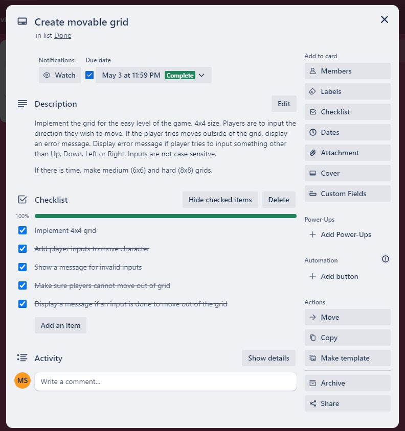

3. Clues


4. Key

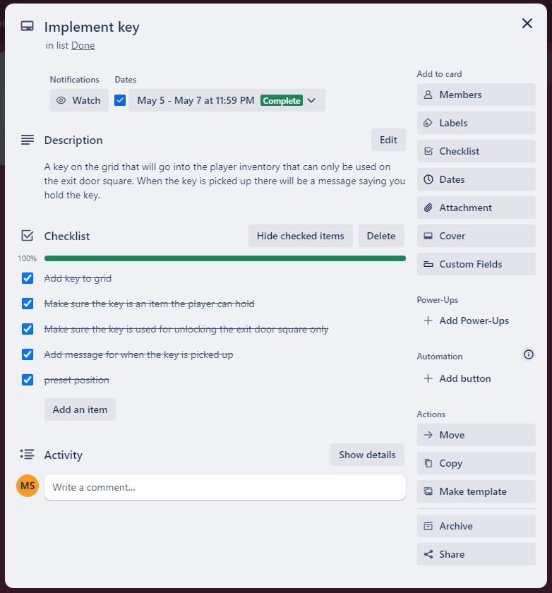

5. Exit Door

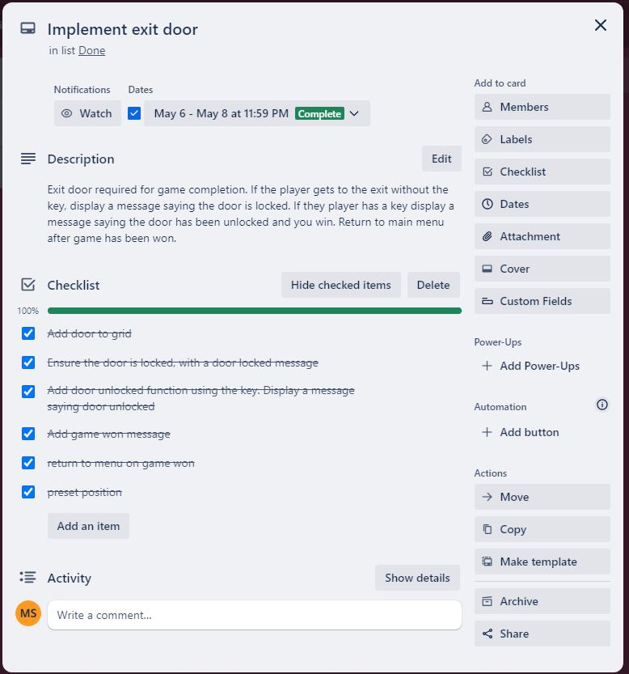

## System Requirements

1. Working computer with MAC OS, Linux or Windows

2. Python 3.10 or higher must be installed on your system

3. Must have access to a bash terminal

## Help Documentation

### Prerequisites:

1. Ensure you have python 3.10.0 or higher installed: [Python install](https://www.python.org/downloads/)

2. Must have Bash for running scripts

3. Git has to be installed onto your computer: [Git Install](https://git-scm.com/book/en/v2/Getting-Started-Installing-Git)

### Installation Instructions

1. Ensure you are in a directory you wish to install the game in e.g.  ```mkdir "filename"``` change into directory ```cd "filename"```.

2. When you are in your chosen directory, clone the repository with command ```git clone git@github.com:MikeLS95/Escape-Room.git```

3. Ensure you are in the source file by using the command ```cd ./Escape-Room/src```.  

4. Enjoy the Escape Room!

### Dependencies

1. Check to make sure that the game can be executed by running ```chmod +x escape_room.sh```.

2. Run script when you are ready to play the escape room ```./escape_room.sh```.

### References

Rivera), PW (Thanks to CJ and S n.d., pyfiglet: Pure-python FIGlet implementation, PyPI
